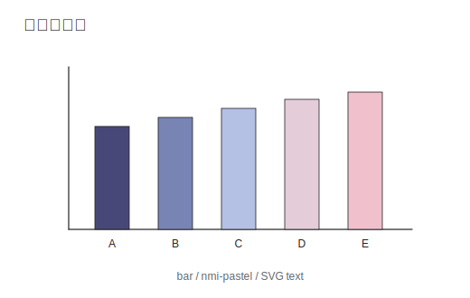
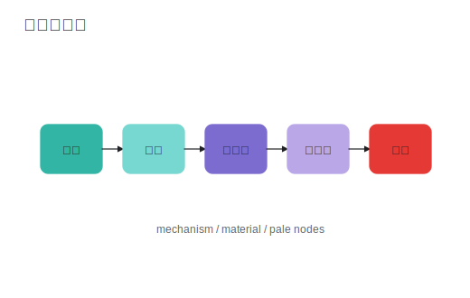
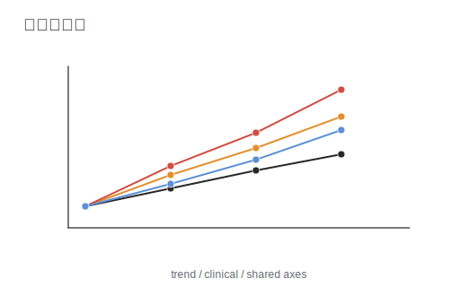
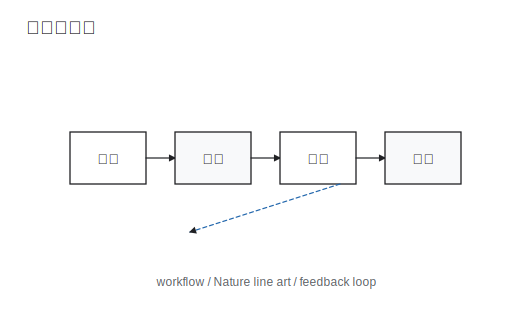
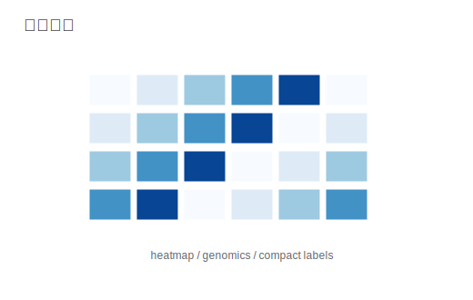
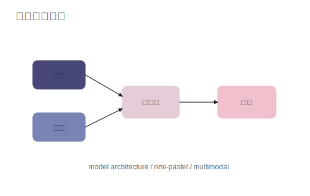
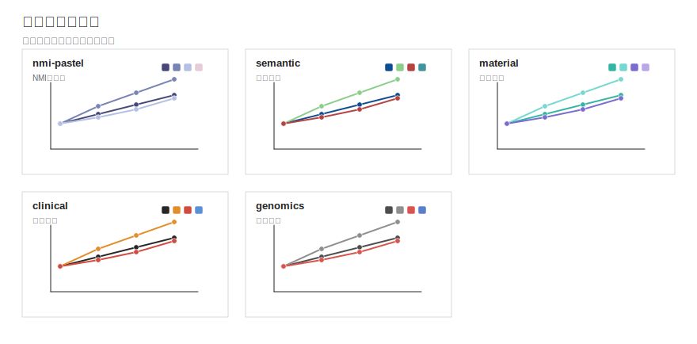
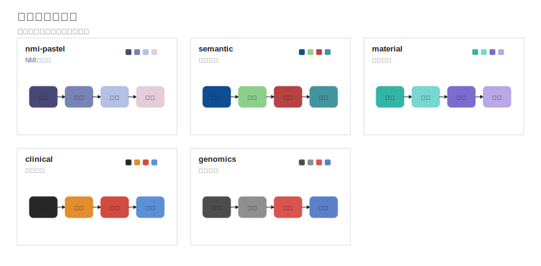

# Research Figure Composer Skill

一个用于 Codex 的科研图组合 skill。它把三条路线合在一起：Draw.io 负责机制图、流程图和模型架构图，`nature-figure` 风格规则负责 Nature 论文感的数据图，AutoFigure-Edit 作为高级文本转 SVG 草图路线。默认输出可编辑 SVG，并保留源文件或生成脚本，方便后续修改。

仓库地址：`https://github.com/shuang-afk/research-figure-composer-skill`

## 能做什么

- 数据图：折线图、散点图、柱状图、箱线图、热图、多 panel 数据图。
- 示意图：机制图、流程图、方法路线图、模型架构图、系统架构图。
- 高级草图：把一段论文方法/机制描述转成可编辑 SVG 初稿，再人工检查和修正。
- 风格：白底、细线、低饱和配色、短标签、可编辑文字，接近 Nature/高水平期刊图件的克制表达。
- 交互：生成前先展示图类型示例和色系对比图，再问一次关键信息；用户说“直接生成/跳过确认”时才跳过。

## 安装

在 PowerShell 里运行：

```powershell
$env:PYTHONUTF8 = '1'
python "$env:USERPROFILE\.codex\skills\.system\skill-installer\scripts\install-skill-from-github.py" --repo shuang-afk/research-figure-composer-skill --path skills/research-figure-composer
```

安装完成后重启 Codex，让新 skill 被加载。

如果本地已经存在同名 skill，安装脚本会停止。先备份或删除旧目录：

```powershell
Rename-Item "$env:USERPROFILE\.codex\skills\research-figure-composer" "research-figure-composer.backup"
```

然后重新运行安装命令。

## 快速使用

在 Codex 里直接说：

```text
用 $research-figure-composer 生成一个折线图
```

或：

```text
生成一个中文机制图，Nature 论文风格
```

skill 会先展示预存示例和色系预览，再问你一次：

- 要生成哪类图；
- 中文还是英文；
- 色系选哪张预览里的哪一格；
- 图要表达的核心结论；
- 是否有数据、节点内容或模型结构。

如果你想跳过确认，直接说：

```text
用 $research-figure-composer 直接生成一个 Nature 风格柱状图，数据你自己编造，中文，输出 SVG
```

## 示例图

### 图类型示例

| 数据图 | 示意图 |
|---|---|
|  |  |
|  |  |
|  |  |

### 数据图色系



### 示意图色系



## 色系

| 色系 | 适合场景 |
|---|---|
| `nmi-pastel` | 默认 Nature Machine Intelligence 式低饱和多组对比，适合模型、方法、消融实验。 |
| `semantic` | 类别语义更明确，适合不同生物过程、材料模块、算法分支。 |
| `material` | 偏材料/机制图，适合反应路径、材料结构、传感机制。 |
| `clinical` | 临床/队列/时间随访，颜色更稳重。 |
| `genomics` | 组学矩阵、基因模块、热图和多变量结果。 |

实际询问用户时，不只给这些名字，会展示上面的色系对比 SVG。

## 本地脚本用法

数据图脚本会自动安装缺失的 `matplotlib` 和 `numpy`：

```powershell
python "$env:USERPROFILE\.codex\skills\research-figure-composer\scripts\nature_svg_plot.py" `
  --input data.csv `
  --kind bar `
  --x model `
  --y score `
  --group method `
  --palette nmi-pastel `
  --output figure.svg
```

校验 SVG：

```powershell
python "$env:USERPROFILE\.codex\skills\research-figure-composer\scripts\validate_svg.py" figure.svg
```

生成内置示例图库：

```powershell
python "$env:USERPROFILE\.codex\skills\research-figure-composer\scripts\generate_example_gallery.py" `
  --output-dir "$env:USERPROFILE\.codex\skills\research-figure-composer\assets\examples"
```

## 仓库结构

```text
research-figure-composer-skill/
├── README.md
├── LICENSE
├── NOTICE.md
├── RELEASE_CHECKLIST.md
└── skills/
    └── research-figure-composer/
        ├── SKILL.md
        ├── agents/openai.yaml
        ├── assets/examples/*.svg
        ├── references/*.md
        └── scripts/*.py
```

## 发布校验

维护者发布前建议运行：

```powershell
$env:PYTHONUTF8 = '1'
python "$env:USERPROFILE\.codex\skills\.system\skill-creator\scripts\quick_validate.py" ".\skills\research-figure-composer"
python ".\skills\research-figure-composer\scripts\validate_svg.py" ".\skills\research-figure-composer\assets\examples\palette-data.svg"
python ".\skills\research-figure-composer\scripts\validate_svg.py" ".\skills\research-figure-composer\assets\examples\palette-diagram.svg"
```

期望结果：skill frontmatter 通过校验，SVG 内有可编辑文本，没有 raster image。

## 依赖

- Python 3.9+。
- `matplotlib` 和 `numpy`：由 `nature_svg_plot.py` 自动安装。
- Draw.io / diagrams.net：用于后续编辑 `.drawio` 源文件，生成 SVG 本身不强制依赖。
- AutoFigure-Edit：可选高级路线，用于文本转 SVG 初稿；没有安装时，skill 会退回到本地可编辑 SVG 草图流程。

## 许可

MIT License。见 [LICENSE](LICENSE)。

本仓库的 Nature 风格规则参考并适配了开源 `nature-skills` / `nature-figure` 工作流的设计思想；归属和说明见 [NOTICE.md](NOTICE.md)。
